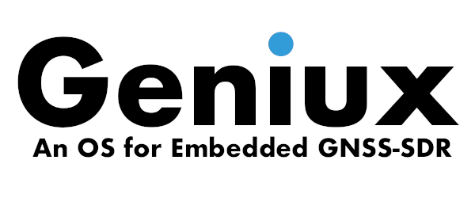

<!-- prettier-ignore-start -->
[comment]: # (
SPDX-License-Identifier: MIT
)

[comment]: # (
SPDX-FileCopyrightText: 2020-2022 Carles Fernandez-Prades <carles.fernandez@cttc.es>
)
<!-- prettier-ignore-end -->

# yocto-geniux

[](https://api.reuse.software/info/github.com/carlesfernandez/yocto-geniux)

The purpose of this repository is to automate the generation in a virtualized
development environment of Geniux images and their corresponding Software
Development Kit (SDK) for the cross-compilation of
[GNSS-SDR](https://gnss-sdr.org) on embedded devices, as well as bootable images
that can be copied to an SD card and make your device ready to go.

The Docker images generated by the `Dockerfile` file of this repository can run
the building process defined by the
[meta-gnss-sdr](https://github.com/carlesfernandez/meta-gnss-sdr) Yocto layer.

More info at:
 - [Cross-compiling GNSS-SDR](https://gnss-sdr.org/docs/tutorials/cross-compiling/).
 - [Announcement of Geniux 21.08 release](https://gnss-sdr.org/introducing-geniux-v2108/).
 - [Announcement of Geniux 22.02 release](https://gnss-sdr.org/introducing-geniux-v2202/).

The name Geniux comes from <ins>**G**</ins>NSS-SDR for <ins>**E**</ins>mbedded
G<ins>**N**</ins>U/L<ins>**i**</ins>n<ins>**ux**</ins>.

<p align="center">
  
</p>

## Building Geniux releases in a virtualized environment

Get a powerful machine (as much RAM, storage capacity, and CPU cores as you can)
and [install the Docker engine](https://docs.docker.com/engine/install/) on it.
Make sure that it is up and running.

> Note: the `geniux-builder.sh` script makes use of the `zip` and `unzip` tools.
> On Debian/Ubuntu machines, you can install them by doing:
>
> ```
> $ sudo apt-get install zip unzip
> ```

Then, get the source code of this repository and go to its base path:

```
$ git clone https://github.com/carlesfernandez/yocto-geniux
$ cd yocto-geniux
```

Now you are ready to build Geniux images for the release you want with a single
command, by using the `geniux-builder.sh` script. Taking a look at its help
message:

```
$ ./geniux-builder.sh --help
This script builds and stores Geniux images.

Usage:
./geniux-builder.sh [version] [manifest] [machine] (--image-only / -i)

Options:
 version   Geniux version: rocko, sumo, thud, warrior, zeus,
           dunfell, gatesgarth, hardknott, honister. Default: dunfell
           Check available branches at https://github.com/carlesfernandez/meta-gnss-sdr
 manifest  Geniux version manifest: 21.02, 21.08, 22.02, latest. Default: latest
           Dated manifests available at https://github.com/carlesfernandez/oe-gnss-sdr-manifest/tags
 machine   Specify your (list of) MACHINE here. By default, zedboard-zynq7 and raspberrypi3 are built.
           If more than one, surround it with quotes, e.g.: "raspberrypi4-64 intel-corei7-64"

 --image-only / -i  (optional) Build the Docker the image but do not execute the container.

Environment variables that affect behavior:
 GENIUX_MIRROR_PATH          Base path to local mirror. Only used if set.
                             e.g.: 'export GENIUX_MIRROR_PATH=/home/carlesfernandez/mirror'
                             The mirror is expected to be at '$GENIUX_MIRROR_PATH/sources/$version'
 GENIUX_STORE_PATH           Path in which products will be stored. Only used if set.
                             e.g.: 'export GENIUX_STORE_PATH=/home/carlesfernandez/geniux-releases'
 GENIUX_STORE_REQUIRES_SUDO  If set, the script will ask for super-user privileges to write in the store.
                             You will be asked only once at the beginning. The password will not be revealed.
                             e.g.: 'export GENIUX_STORE_REQUIRES_SUDO=1'
```

Before calling the script, you might want to set some (optional) environment
variables on your host machine:

```
$ export GENIUX_MIRROR_PATH=/home/user/mirror
$ export GENIUX_STORE_PATH=/home/user/geniux-releases
$ export GENIUX_STORE_REQUIRES_SUDO=1
```

Examples of usage:

> NOTE: if you are operating on a remote host through `ssh`, you might want to
> run `screen` at this point, so the work won't be lost in case of a session
> drop.

- Build Geniux release `dunfell`, with manifest date `latest`, for machines
  `zedboard-zynq7` and `raspberrypi3`:

  ```
  $ ./geniux-builder.sh
  ```

- Build Geniux release `thud`, with manifest date `latest`, for machines
  `zedboard-zynq7` and `raspberrypi3`:

  ```
  $ ./geniux-builder.sh thud
  ```

- Build Geniux release `thud`, with manifest date `22.02`, for machines
  `zedboard-zynq7` and `raspberrypi3`:

  ```
  $ ./geniux-builder.sh thud 22.02
  ```

- Build Geniux release `warrior`, with manifest date `latest`, only for machine
  `zedboard-zynq7`:

  ```
  $ ./geniux-builder.sh warrior latest zedboard-zynq7
  ```

- Build Geniux release `warrior`, with manifest date `22.02`, only for machine
  `raspberrypi3`:

  ```
  $ ./geniux-builder.sh warrior 22.02 raspberrypi3
  ```

- Build Geniux release `rocko`, with manifest date `latest`, for machines
  `zedboard-zynq7` and `zcu102-zynqmp`:

  ```
  $ ./geniux-builder.sh rocko latest "zedboard-zynq7 zcu102-zynqmp"
  ```

- Build Geniux release `hardknott`, with manifest date `latest`, for machines
  `raspberrypi4` and `intel-corei7-64`:

  ```
  $ ./geniux-builder.sh hardknott latest "raspberrypi4 intel-corei7-64"
  ```

- Build Geniux release `honister`, with manifest date `latest`, only for machine
  `raspberrypi4-64`:

  ```
  $ ./geniux-builder.sh honister latest raspberrypi4-64
  ```

At the end of the building process, the output products will be placed in a
folder named `./$version/output_$machine` under the `yocto-geniux` base path,
and copied to `$GENIUX_STORE_PATH` if that environment variable is defined.

If you want to have more detailed control of the whole process, or you are
interested on further development (making changes to the Yocto layers, adding
new features or recipes, fixing bugs, etc.), then you can skip running the
container generated by the `geniux-builder.sh` script and follow the
instructions below.


## Generating Geniux images and the SDK installer step-by-step

### Non-interactive method

> NOTE: if you are operating on a remote host through `ssh`, you might want to
> run `screen` at this point, so the work won't be lost in case of a session
> drop.

Build the Docker image but do not run the container:

```
$ ./geniux-builder.sh [version] [manifest] [machine] -i
```

Create an output folder and run the container:

```
$ mkdir -p output
$ docker run -it --rm \
  -v $PWD/output:/home/geniux/yocto/output \
  --privileged=true \
  geniux-$version:$manifest.$machine
```

If you have a local mirror available, you can provide access from within the
container as:

```
$ mkdir -p output
$ docker run -it --rm \
  -v $PWD/output:/home/geniux/yocto/output \
  -v $my_mirror:/source_mirror/sources/$version \
  --privileged=true \
  geniux-$version:$manifest.$machine
```

replacing `$my_mirror` by the actual path of your mirror and `$version` by the
actual version name you used when building the container. If you do not have any
local mirror, just omit the `-v $my_mirror:...` line.

The build process will take several hours. At its ending, the image files will
be under your `./output` folder, so _outside_ the container. The `./output`
folder must be empty before starting the run. The container itself will be
erased after completion.

### Interactive method

> NOTE: if you are operating on a remote host through `ssh`, you might want to
> run `screen` at this point, so the work won't be lost in case of a session
> drop.

Build the Docker image but do not run the container:

```
$ ./geniux-builder.sh [version] [manifest] [machine] -i
```

Now run the container in the interactive mode:

```
$ mkdir -p output
$ docker run -it --rm \
   -v $PWD/output:/home/geniux/yocto/output \
   -v $my_mirror:/source_mirror/sources/$version \
   --privileged=true \
   geniux-$version:$manifest.$machine bash
```

replacing `$my_mirror` by the actual path of your mirror and `$version` by the
actual version name you used when building the container. If you do not have any
local mirror, just omit the `-v $my_mirror:...` line.

**Notice the final `bash`, that will take you to the bash console without
executing the predefined commands.**

Now, inside the container, prepare the building environment:

```
$ repo sync   # Recommended if you are building the 'latest' manifest
$ source ./oe-core/oe-init-build-env ./build ./bitbake
```

At this point, you can modify the `conf/local.conf` file, add new recipes, and
experiment as you want. The `nano` editor is available for that. When you are
ready to build the development image:

```
$ bitbake gnss-sdr-dev-image
```

and the corresponding SDK script installer:

```
$ bitbake -c populate_sdk gnss-sdr-dev-image
```

For building an image with the Xfce Desktop Environment and gnss-sdr already
included:

```
$ bitbake gnss-sdr-demo-image
```

If you want to build the Docker images, you need to run the container with the
flag `--privileged=true` and to start the Docker daemon inside the container:

```
$ sudo service docker start
$ bitbake gnss-sdr-dev-docker
```

The build process will take several hours. At its ending, the image files will
be under `./build/tmp-glibc/deploy` folder. Move them to the
`/home/geniux/yocto/output` folder:

```
$ mv ./tmp-glibc/deploy/images /home/geniux/yocto/output/
$ mv ./tmp-glibc/deploy/sdk /home/geniux/yocto/output/
```

Now, when doing `exit` from the container, the build artifacts will be at the
`./output` folder you created in your machine, so _outside_ the container. The
container itself will be erased at exit.

## Copyright and License

Copyright: &copy; 2020-2022 Carles Fern&aacute;ndez-Prades,
[CTTC](https://www.cttc.cat). All rights reserved.

The content of this repository is released under the [MIT](./LICENSE) license.

## Acknowledgements

This work was partially supported by the Spanish Ministry of Science,
Innovation, and Universities through the Statistical Learning and Inference for
Large Dimensional Communication Systems (ARISTIDES, RTI2018-099722-B-I00)
project.
